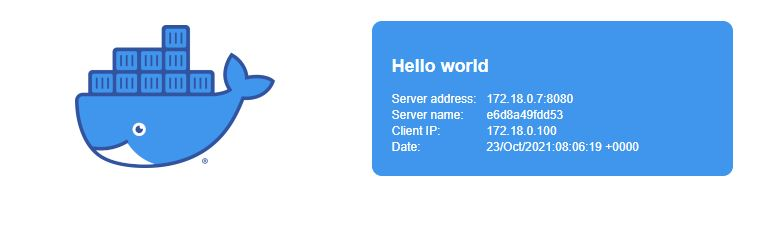

# Ultimate Docker Raspberry pi guide

In this tutorial I will show how to create a rpi with home-assistant, nextcloud and monitoring with docker-compose

docker container that will be installed:

- certbot: ACME to get https, we will use dns challenge for subdomains
- nginx: will be used for reverse proxy
- home assistant: home automation
- nextcloud: self hosted cloud
- grafana: monitoring dashboard
- prometheus: monitoring DB
- node-exporter: monitoring data exporter

## Prerequisite

- RPI 4 with ubuntu
- Duckdns domain point to your ip
- Docker and docker-compose installed

## Letsencrypt

Let's start by creating https for our domains

edit the `certbot/docker-compose.yml` change DUCKDNS_DOMAINS to your domains and email to your email.
run:
`docker-compose -f certbot/docker-compose.yml up -d`

This will create cerrificate for sub domains.

add the to cron job by to run every 2 month
`crontab -e`
`0 0 1 */2 * docker-compose -f ~/<FOLDER_NAME>/certbot/docker-compose.yml up -d`

## Reverse proxy with nginx

we will use hello-world webtest container to test our configuration

create `docker-compose.yml` with

```yaml
version: '3.8'

services:
  proxy:
    image: 'nginx:1.21.3-alpine'
    volumes:
      - './rproxy/conf.d:/etc/nginx/conf.d'
      - './rproxy/dhparams:/etc/nginx/cert'
      - './rproxy/logs:/var/log/nginx'
      - './certbot/etc:/etc/letsencrypt'
      - '/etc/localtime:/etc/localtime:ro'
    ports:
      - '80:80'
      - '443:443'
    restart: always
    networks:
      default:
        ipv4_address: 172.18.0.3

  webtest:
    image: jfxs/hello-world:latest

networks:
  default:
    ipam:
      config:
        - subnet: 172.18.0.0/24
```

Now lets configure for the reverse proxy.

Starting by making dhparams file to make it more secure run below commands. (This will take sometime)

```bash
mkdir -p rproxy/dhparams
cd rproxy
openssl dhparam -out dhparams/dhparams.pem 4096
```

now lets copy the including files for the services:

`rproxy/redirect.conf`

`rproxy/conf.d/common.in`

`rproxy/conf.d/common_location.in`

`rproxy/ssl.in`


In `ssl.in` replace below example domain to your domain.

```nginx
ssl_certificate             /etc/letsencrypt/live/example.duckdns.org/fullchain.pem;
ssl_certificate_key         /etc/letsencrypt/live/example.duckdns.org/privkey.pem;
```

add the webtest configuration to `rproxy/conf.d/webtest.conf` and change the "example" domain to your domain

```nginx
  server_name   webtest.example.duckdns.org;
```

start the docker-compose `docker-compose up -d`.

open web browser and navigate to `https://webtest.<YOUR_DOMAIN>.duckdns.org` you should see



Congregational you did it!

## Adding home-assistant

Before adding home assistant lets add mqtt server.

mqtt server is light weight message queue that IOT devices can use. run:

```bash
mkdir -p mkdir mqtt/{data,logs,config}
```

add `mqtt/config/mosquitto.conf`

now lets create user and password for our mqtt server
create new file `mqtt/config/passwd` insert your user name and password inside

```text
mqttUser:mqttPass
```

save the file and run:

`docker run -v /$(pwd)/mqtt/config:/mosquitto/config eclipse-mosquitto mosquitto_passwd -U /mosquitto/config/passwd`

This will update the mqtt password text to hash

Add mqtt service to the docker-compose file

```yaml
  mqtt:
    image: 'eclipse-mosquitto:latest'
    volumes: 
      - './mqtt/config:/mosquitto/config'
      - './mqtt/data:/mosquitto/data'
      - './mqtt/log:/mosquitto/log/'
    ports:
      - '1883:1883'
    networks:
      default:
        ipv4_address: 172.18.0.10
```

Adding home assistant service

```yaml
  hass:
    image: 'homeassistant/home-assistant:stable'
    depends_on:
      - mqtt
    network_mode: host
    volumes:
      - './hass/config:/config'
      - '/etc/localtime:/etc/localtime:ro'
    restart: always
```

add home assistant configuration to `hass/config/configuration.yaml`

add nginx configuration to `rproxy/conf.d/hass.conf` and change example to your domain

Start the new services with `docker-compose up -d`

## Nextcloud

same steps as before add reverse proxy, `rproxy/conf.d/nextcloud.conf`
add nextcloud service to dock-compose file

```yaml
    volumes:
      - './nextcloud/html:/var/www/html'
      - './nextcloud/config:/var/www/html/config'
      - './nextcloud/custom_apps:/var/www/html/custom_apps'
      - './nextcloud/data:/var/www/html/data'
      - './nextcloud/themes:/var/www/html/themes'
      - '/etc/localtime:/etc/localtime:ro'
    restart: unless-stopped
```

create nextcloud folder `mkdir nextcloud`

and run `docker-compsoe up -d`

## Adding monitoring

start by adding node-exporter

```yaml
  node-exporter:
    image: 'prom/node-exporter:latest'
    restart: always
    volumes:
      - '/proc:/host/proc:ro'
      - '/sys:/host/sys:ro'
      - '/:/rootfs:ro,rslave'
    command:
      - '--path.procfs=/host/proc'
      - '--path.rootfs=/rootfs'
      - '--path.sysfs=/host/sys'
      - '--collector.filesystem.mount-points-exclude=^/(sys|proc|dev|host|etc)($$|/)'
```

This service don't need nginx configuration as we don't need outside communication.

Add the prometheus db

```yaml
  prometheus:
    image: 'prom/prometheus:latest'
    volumes:
      - './prometheus/config:/etc/prometheus'
      - './prometheus/data:/prometheus'
    restart: unless-stopped
```

Adding grafana

```yaml
  grafana:
    image: 'grafana/grafana:latest'
    volumes:
      - './grafana/data:/var/lib/grafana'
      - './grafana/provisioning:/etc/grafana/provisioning'
    restart: unless-stopped
```

and grafna nginx configuration `rproxy/conf.d/grafana.conf`

run `./monitor_permissions.sh`

start docker-compose with `docker-compose up -d`
